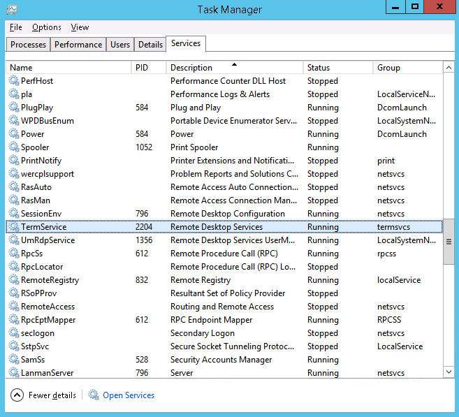
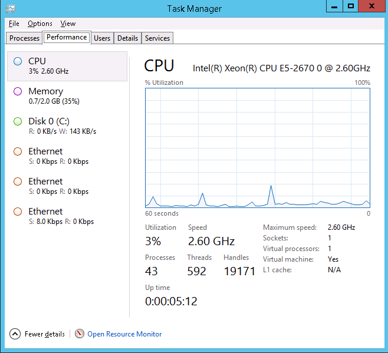
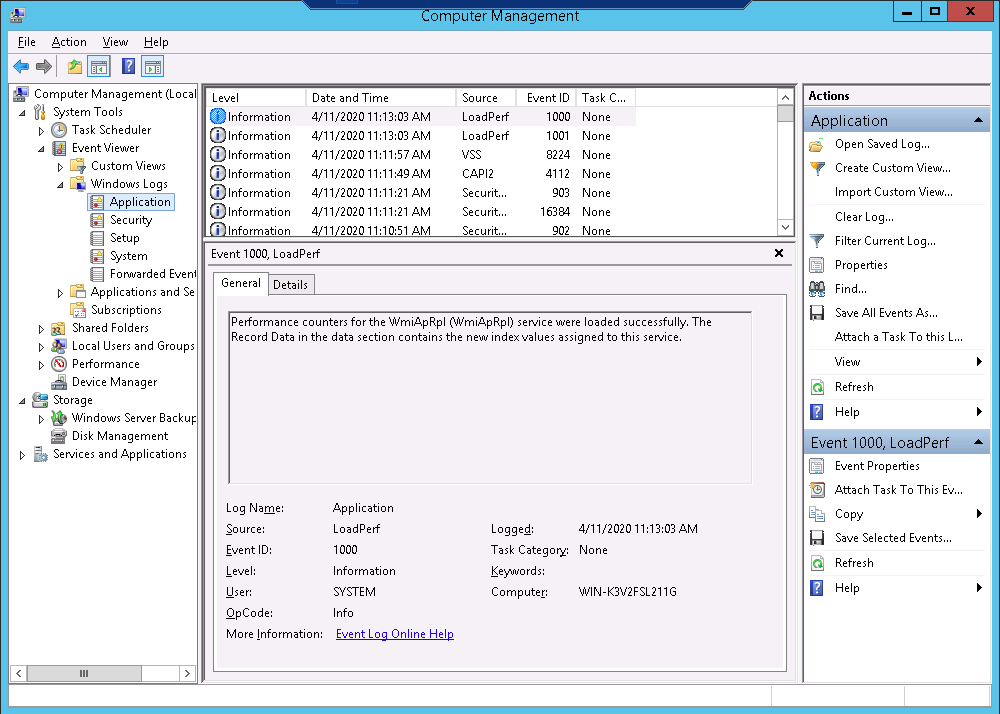
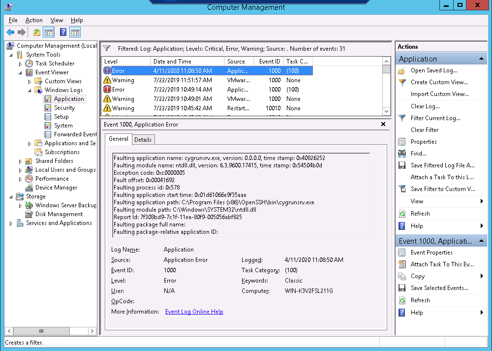
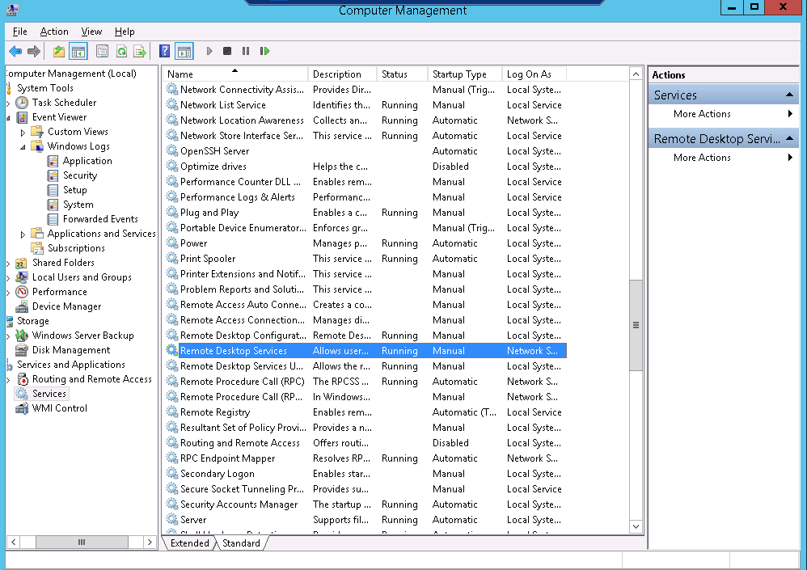
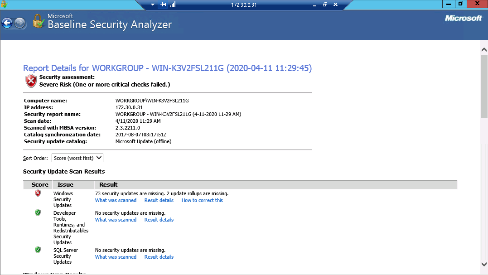
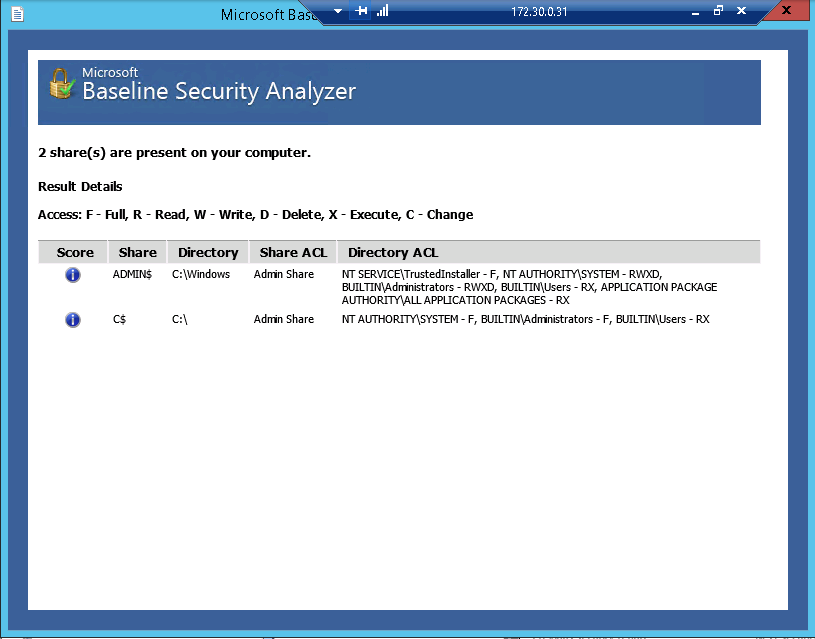

# Lab 10 :end:

**Authors:** Daniel Gisolfi, James Ekstract

## Section 1

### screen capture showing all the processes associated with Remote Desktop Services

###  screen capture showing the current system performance

### screen capture showing the Windows Application Log

### screen capture showing the entire event entry for the error

### screen capture showing the Status and Startup Type columns for the Windows services that manage Remote Desktop Services 

### screen capture showing the first page of the report, including the header

### screen capture showing the result details for the Shares issue

## Section 2

### Part 1

#### The services associated with Remote Desktop Services

#### The current system performance

#### The AVG processes displayed on the Memory tab of the Resource Monitor

#### The AVG update URL displayed in the Resource Monitor

#### The entire entry for the first Application error in the Application logs

#### The entire entry for the first Application error in the System logs

#### The entire entry for the first Security issue in the Windows Security logs

#### The Windows services that manage Remote Desktop Services

#### The Dependencies of the Remote Desktop Services service

### Part 2

#### The MBSA report results

#### The first page of critical updates

#### The scan results that no longer include the update that was installed

#### KB number of installed update:

KB3011780