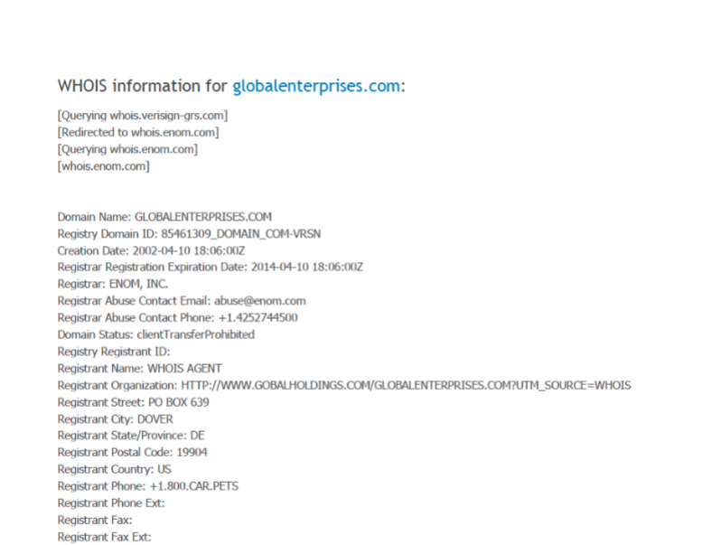
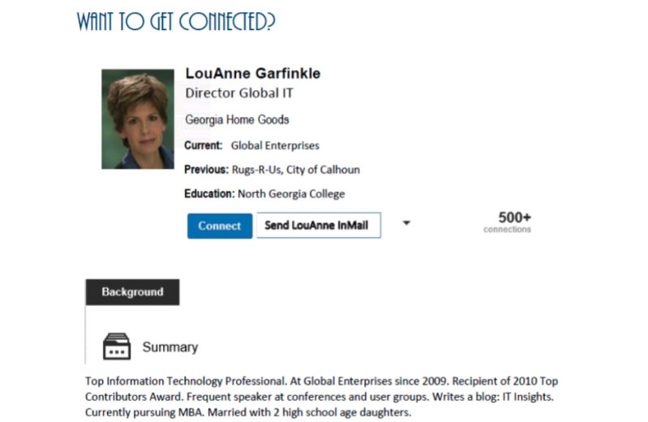
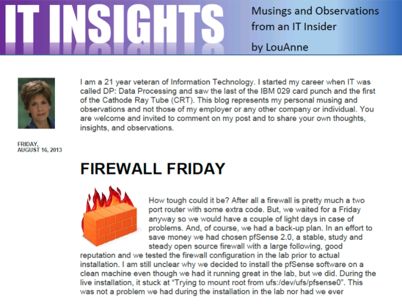

# Lab 6 :beer:

**Authors:** Daniel Gisolfi, James Ekstract

## Section 1

### A screen capture showing the whois information for Global Enterprises



### A screen capture showing LouAnne’s GetConnected profile



###  A screen capture showing the first blog entry



### A screen capture showing the second blog entry


### Firewall Software

**Version:** 2.4.4

**site**: https://www.pfsense.org/download/


## Section 2

### Part 1

#### The services offered by the company "Corporation Techs"


#### The corporate officers of Corporation Techs


#### Details about each corporate officer of Corporation Techs from LinkedIn

| Name           | Position | Alma Mater                 | Years Attended | Location    | Longest Company Career |
| -------------- | -------- | -------------------------- | -------------- | ----------- | ---------------------- |
| Andrew Symonds | CEO      | San Diego State University |                | Addison, TX | Wodash Incorporated    |
| Mike Hutchins  | CSO      | Virginia Tech              | 1992-1996      | Addison, TX | Aegis Secured          |
| Dee Dasher     | COO      | Texas State University     | 1985-1989      | Addison, TX | Dante's Inc            |


#### The search results for Andrew Symonds' LinkedIn profile using Google's advanced search operators


#### The individualized Google search using advanced operators


### Part 2

#### The confirmation message that appears after the contact form is submitted


#### The content of the contact form email


#### The webpage displayed after clicking the confirmation link in the above email


### Part 3

#### The results of the nmap scan of the Corporation Techs website


#### The WHOIS data for the suspicious IP address


#### The search results for the pricesheet in the Apache server logs, displayed in Excel


#### The script that will open the "pricecheat.pdf file in the website's source code"


#### Actions necessary to open the "pricecheat.pdf file on the Corporation Techs website"

```
alt + s
```

OR

```
ctrl + enter
```


#### The "pricecheat.pdf" file displayed on the Corporation Techs website after executing the necessary actions to display the file

