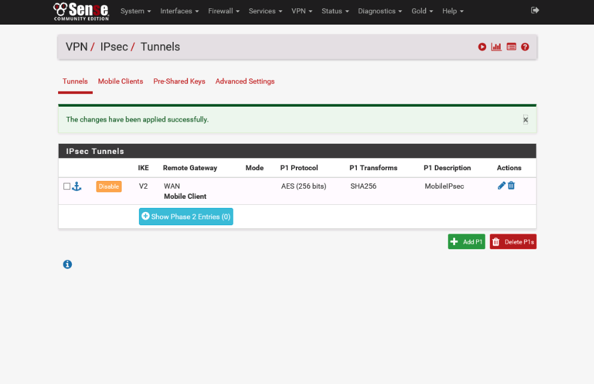
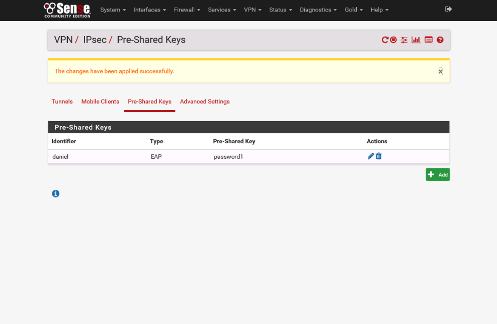

# Lab 7 :mask:

**Authors:** Daniel Gisolfi, James Ekstract

## Section 1

### Screen capture showing the resulting Certificate Authorities table

###  **Screen capture** showing the **Certificates table**

### **Screen capture** showing the **IPsec Tunnels table**

### **Screen capture** showing the **Pre-Shared Keys table**

### **screen capture** showing **the IPsec Rules table**

## Section 2

### Part 1

#### The CA configuration form displayed in pfSense

#### The client settings section of the pfSense OpenVPN wizard

### Part 2

#### The completed OpenVPN configuration

#### The OpenVPN rule on the WAN rules table

#### The OpenVPN rule on the OpenVPN rules table

