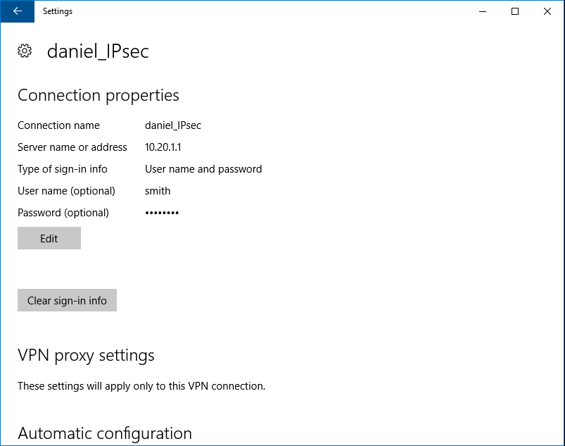
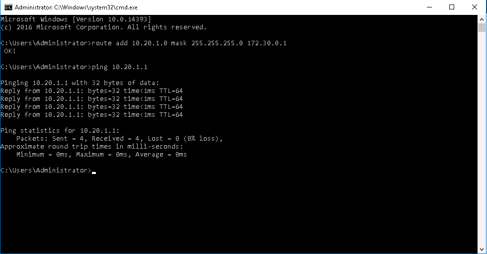
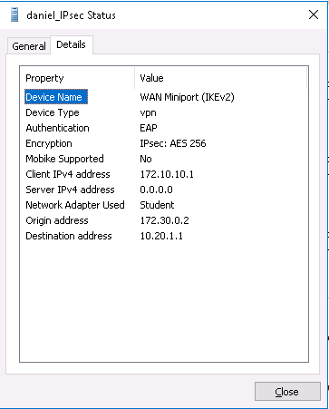
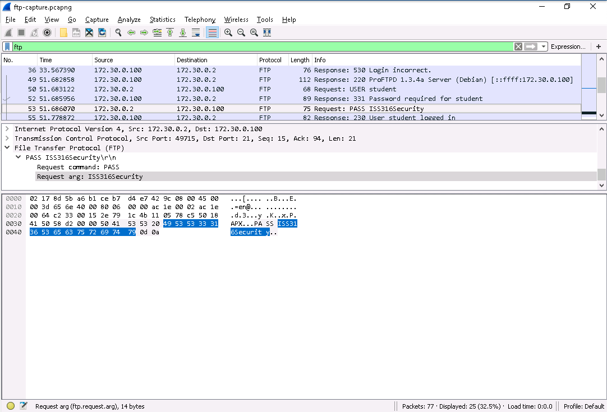
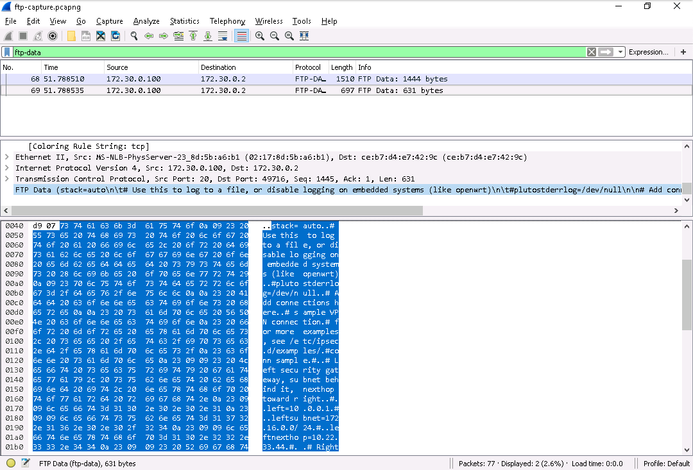
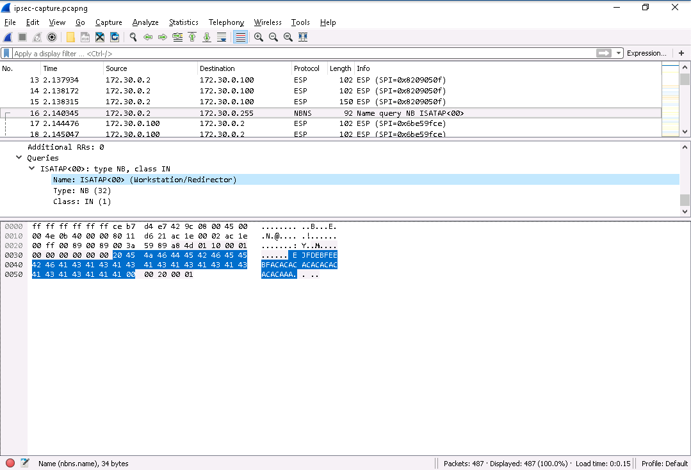
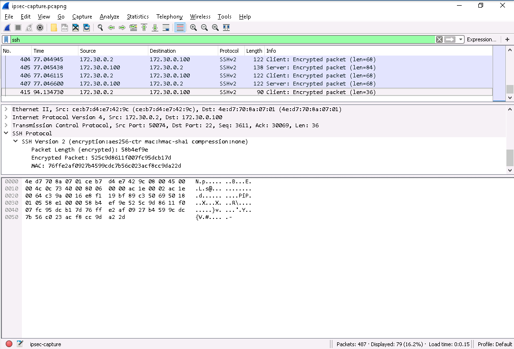
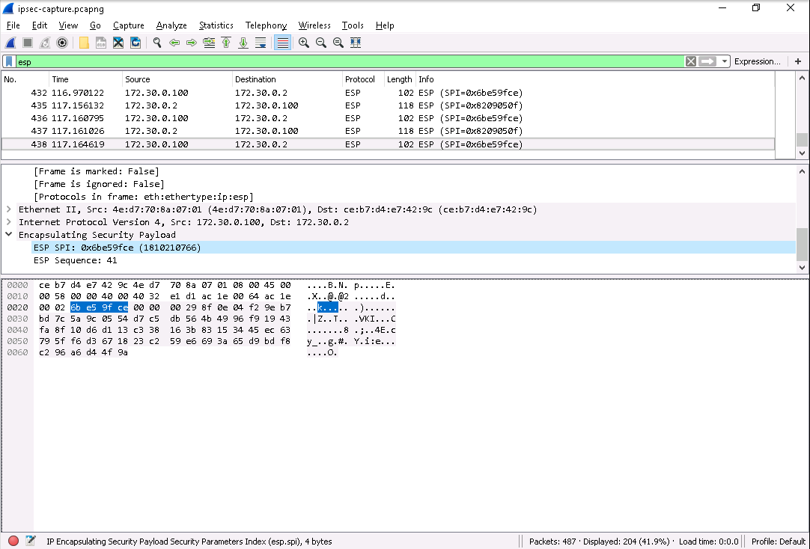

# Lab 8 :robot:

**Authors:** Daniel Gisolfi, James Ekstract

## Section 1

###  Screen capture showing the VPN connection properties

###  Screen capture showing the ping response

### Screen capture showing the VPN Status details

### Screen capture showing the frame that carries the correct password

**Password:** ISS316Security

### Screen capture showing the Wireshark window and the hex data pane for Frame 69 

### Screen capture showing the frame details pane for frame 16

### Screen capture showing the last SSHv2 frame in the SSH file transfer

### Screen capture showing the last frames in the ESP exchange

## Section 2

### Part 1

#### The successful VPN connection

#### The IPsec VPN connection encrypted with AES 256

### Part 2

#### The isakmp protocol frames displayed in Wireshark

#### The filtered FTP frames displayed in Wireshark

#### The contents of file.txt displayed in Wireshark

#### The filtered SSH frames displayed in Wireshark

#### The frame in which the new key is saved to the client:

Frame 568 in EkstractGisolfi_livecapture.pcapng