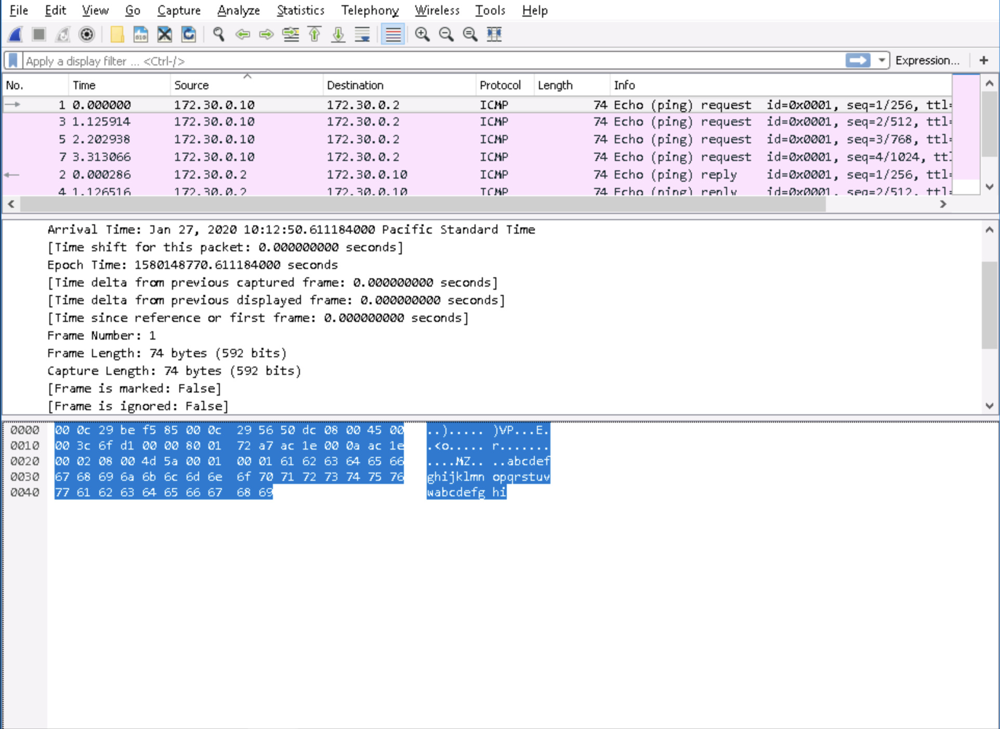
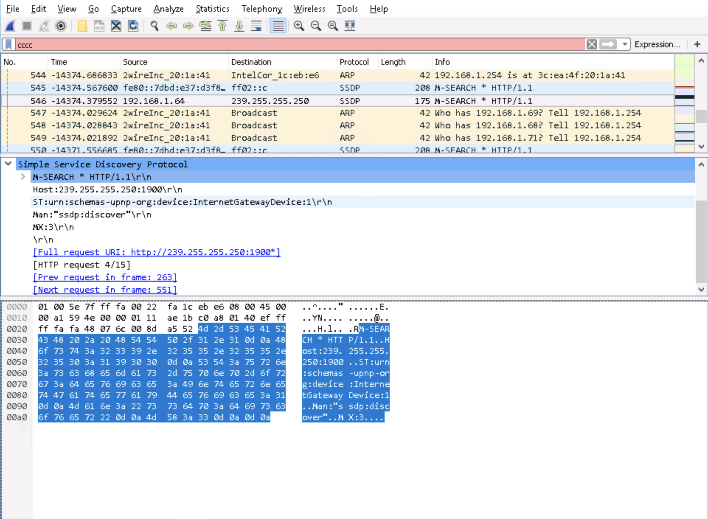
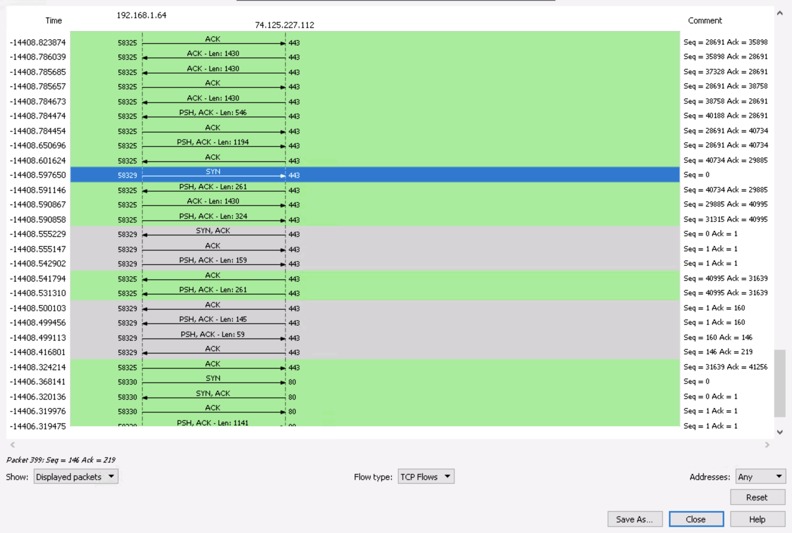

# Lab 1 :detective:

**Authors:** Daniel Gisolfi, James Ekstract 

## Section 1

###  A screen capture** showing **the fields related to time

### A a screen capture showing the complete hexadecimal representation for the source and destination Media Access Control (MAC) addresses

* The code assigned by the IEEE to Intel for use in identifying Intel Core network interfaces: **00:22:fa**
* the MAC address used for IPv4 multicast: **01:00:5e:7f:ff:fa**
* version of the Internet Protocol: **4**
*  source IP address: **192.168.1.64**

### A screen capture showing the related frame numbers for this packet

###  A screen capture showing the time (found in the Time column on the left) that each step of the handshake occurred

## Section 2

