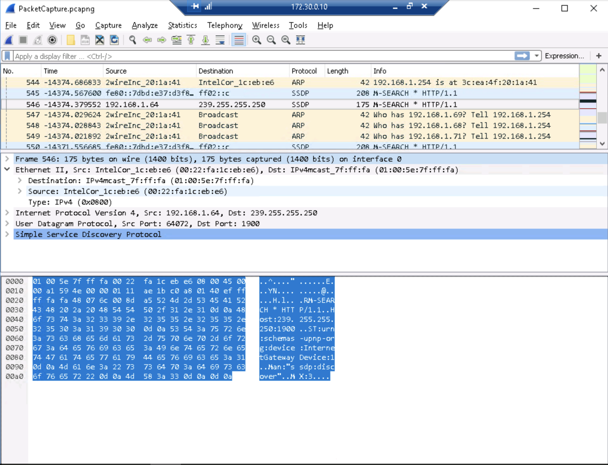

# Lab 1 :detective:

**Authors:** Daniel Gisolfi, James Ekstract 

## Section 1

###  A screen capture** showing **the fields related to time

### A a screen capture showing the complete hexadecimal representation for the source and destination Media Access Control (MAC) addresses

* The code assigned by the IEEE to Intel for use in identifying Intel Core network interfaces: **00:22:fa**
* the MAC address used for IPv4 multicast: **01:00:5e:7f:ff:fa**
* version of the Internet Protocol: **4**
*  source IP address: **192.168.1.64**

### A screen capture showing the related frame numbers for this packet

###  A screen capture showing the time (found in the Time column on the left) that each step of the handshake occurred

## Section 2

### Part 1

####  A screen capture showing the filtered TCP port 80 traffic in Wireshark

#### A screen capture showing the fields related to time of the first frame in WireShark

### Part 2

#### The number of bytes captured vs bytes on the wire of frame 8 in Wireshark

#### The manufacturer of the destination device of frame 8 displayed in Wireshark

#### The source IP address of frame 8 in Wireshark

#### The list of cipher suites used on frame 8 in Wireshark

#### The issuer of the SSL certificate displayed in Wireshark hex pane

#### The certificate information contained in frame 111, displayed in Wireshark

#### The public key and signature hash for the certificate contained in frame 112, displayed in Wireshark

#### The DNS query in packet 1, displayed in Wireshark

