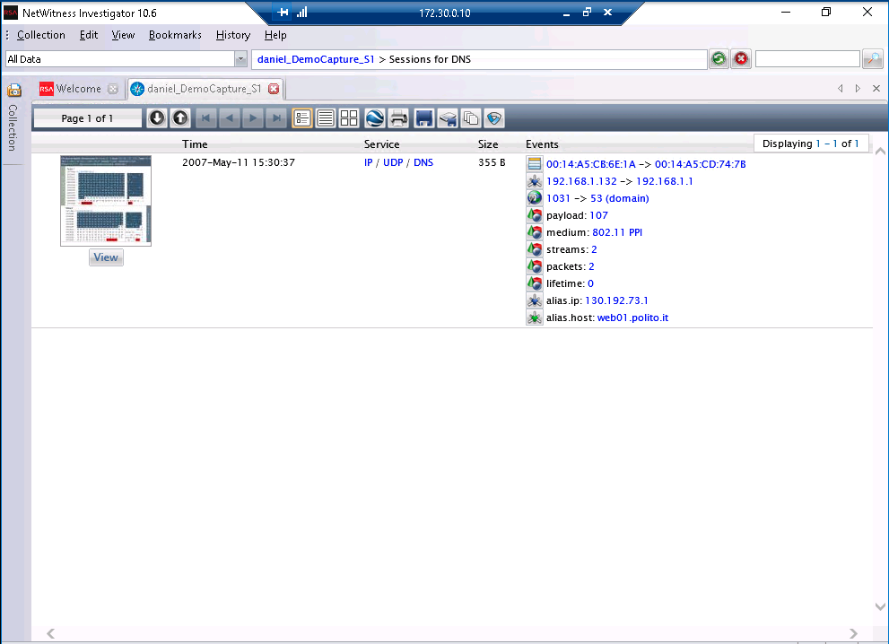
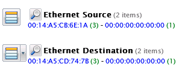

# Lab 2 :computer:

**Authors:** Daniel Gisolfi, James Ekstract

## Section 1

### A screen capture showing the detail found in the IEEE 802.11 QoS Data fields

### A screen capture showing the query name (www.polito.it), the source IP address, and the destination IP address

### A screen capture of the DNS query showing the Hostname Alias, the Source IP Address, and the Destination IP Address fields

### A screen capture showing the Ethernet source and Ethernet destination addresses

Looking at the same information viewed in wire shark from Part 1, Step 18. The view in netwitness investigator is a much higher level view in this case as the desitination adress is shown as `00:00:00:00:00:00 `rather than the value seen in the wireshark screenshot displaying the destination as `00:01:02:27:f9:b2`

## Section 2

### Part 1

#### The list of protocols used in frame 7 displayed in Wireshark

#### The source port used by UDP in frame 18, displayed in Wireshark

#### The domain queried in frame 18, displayed in Wireshark

#### The address details shown in frame 21 (the response to frame 18) displayed in Wireshark

#### The authoritative nameserver in frame 20, displayed in Wireshark

#### The destination MAC address of frame 285, displayed in Wireshark

#### The source and destination ports of frame 285, displayed in Wireshark

#### The attribute value pairs of frame 285, displayed in Wireshark

### Part 2

#### The hostname alias, source IP, destination IP , and source city fields of the perdu.com DNS session displayed in NetWitness Investigator

#### The source and destination cities from the packet capture, displayed in NetWitness Investigator

