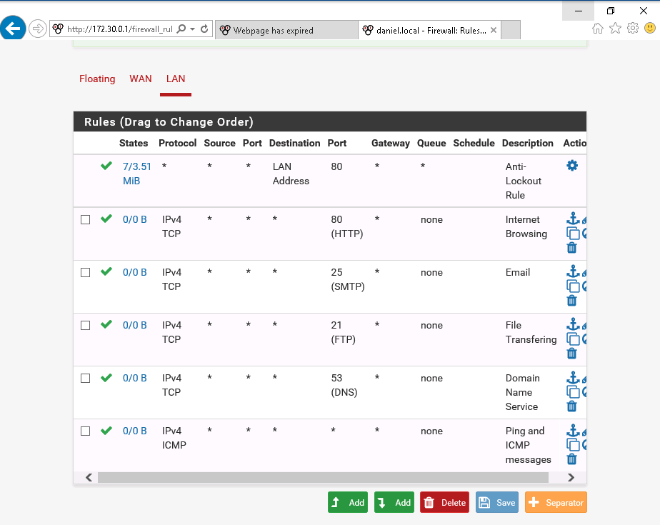

# Lab 3 :closed_lock_with_key:

**Authors:** Daniel Gisolfi, James Ekstract

## Section 1

### Completed Firewall rules

## Section 2

### Part 1

#### The IP addresses of Google's public DNS server

* 8.8.8.8
* 8.8.4.4

#### The current date/time and last config change on the pfSense firewall dashboard

#### The MAC address of the pfSense LAN interface

### Part 2

#### The *EkstractGisolfi* directory created on TargetWindows01

This directory was created once a firewall rule was successfully implemented allowing RDP traffic from vWorkstation to TargetWindows01

