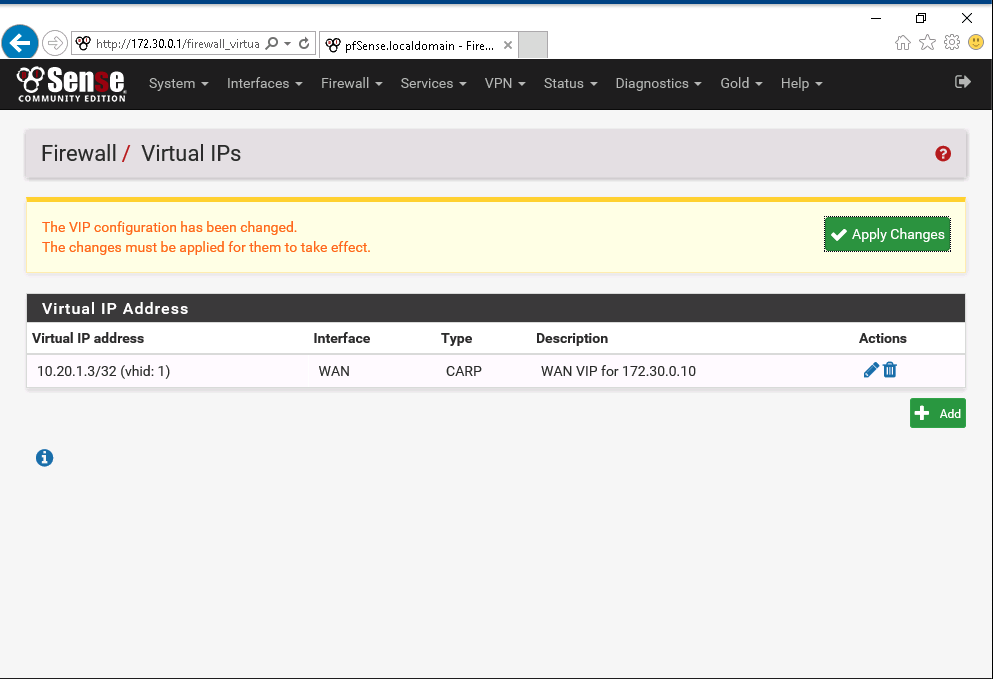

# Lab 4 :floppy_disk:

**Authors:** Daniel Gisolfi, James Ekstract

## Section 1

### A screen capture showing the Virtual IP Address table

###  A screen capture showing the NAT Mappings table 

### A screen capture showing the completed WAN Rules table

 172.30.0.10

## Section 2

### Part 1

#### The Virtual IP address table in pfSense

#### The NAT Mappings table in pfSense

### Part 2

#### The completed WAN Rules table in pfSense

#### The IIS default page at 10.20.1.3 displayed on TagetWindows01

