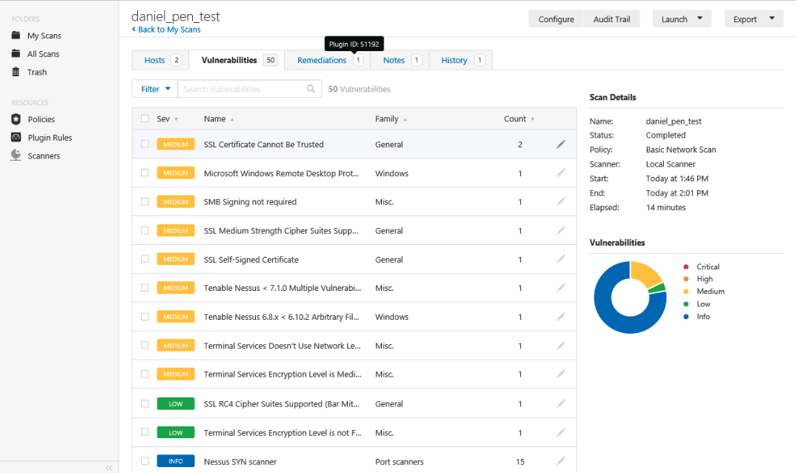

# Lab 5 :coffee:

**Authors:** Daniel Gisolfi, James Ekstract

## Section 1

### A screen capture showing the vulnerability report summary

### A screen capture showing the medium and low vulnerabilities

### A screen capture showing the updated vulnerability report summary

## Section 2

### Part 1

#### The pfSense firewall LAN rules

### Part 2

#### The Tenable Nessus vulnerability report of 10.20.1.1 and 10.20.1.2

#### The detailed vulnerability report for the critical vulnerability discovered by Tenable Nessus

#### The results of the Zenmap SYN scan of the 10.20.1.0/24 subnet

#### Comparison of Zenmap and Nessus SYN scan

Both the Zenmap and Nessus SYN scans were able to detect the presence of certain open ports and the services on them, however Nessus was able to provide a more in-depth analysis of different configurations and applications.

#### The final LAN rules table in pfSense

